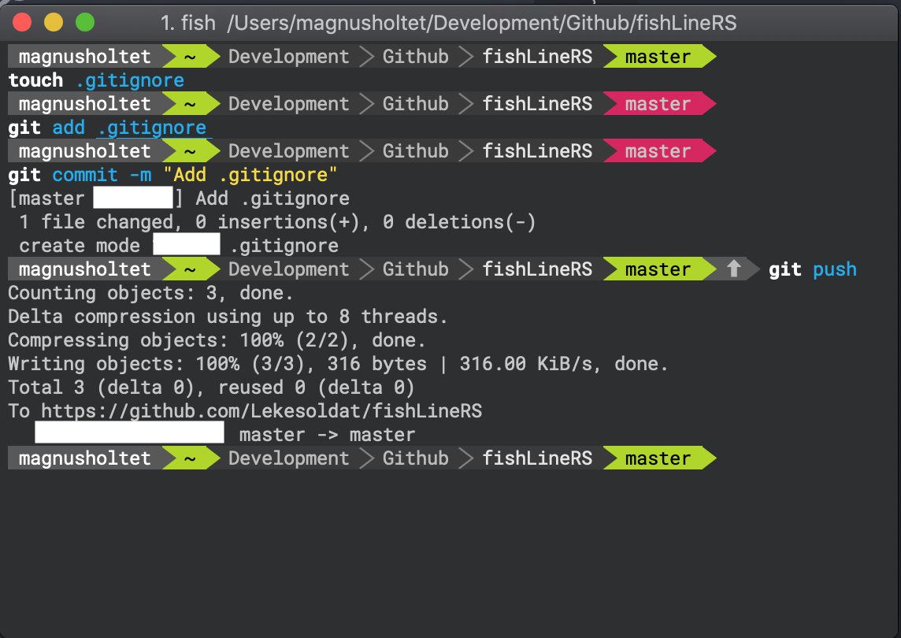

# FishLineRS: Fish Shell + Powerline-rs ❤️
## A brief and probably outdated tutorial on how to get what I think is a clean and functional terminal.

**Disclaimer:** I am not responsible or the creator of anything used in this guide. This is simply my way of setting up fish-shell and powerline-rs to work together. _All credit goes to rightful owners_.
<hr>
<br />

Awfull screenshot of my terminal when adding .gitignore to this project. Pink color means that I have un-synced changes.  




## Step by step walkthrough: 

1. Install [Rust](https://www.rust-lang.org/en-US/install.html)
    ```bash
    curl https://sh.rustup.rs -sSf | sh
    ```
2. Install [Cmake](http://brewformulas.org/Cmake)
    ```bash
    brew install cmake
    ```

3. Install [Powerline-RS](https://github.com/jD91mZM2/powerline-rs)
    ```bash
    cargo install powerline-rs
    ```

4. Create directory for themes to be stored:
    ```bash
    mkdir -p ~/.powerline-rs/themes
    ```

5. Setup your theme:
    ```bash
    cd ~/.powerline-rs/themes
    ```

    Create files at this location, without .file-type-ending. Personally i have fishTheme and bashTheme stored here. Use the template provided and mix with the values.

6. Add this to your ~/.bash_profile
    ```
    # Powerline (powerline-rs)
    prompt() {
        THEME="$HOME/.powerline-rs/themes/bashTheme" # SET YOUR THEME HERE
        MODULES="user,ssh,cwd,perms,git,gitstage"
        MAX_DEPTH="3"
        PS1="$(powerline-rs --shell bash --theme $THEME --modules $MODULES --cwd-max-depth=$MAX_DEPTH $?)"
    }
    PROMPT_COMMAND=prompt
    ```

7. Download and install [fonts](https://github.com/powerline/fonts). Personally I use 'Roboto Mono for Powerline'.
Remember to use the font in your terminal-preferences. 

8. Install [fish-shell](https://fishshell.com)
    ```bash
    brew install fish
    ```

9. Fish-setup (Remember to change the theme-path to your own!)
    ```bash
    function fish_prompt
        powerline-rs --modules "user,ssh,cwd,perms,git" --shell "bare" --cwd-max-depth=3 --theme $HOME/.powerline-rs/themes/fishTheme
    end

    funcsave
    ```

10. Restart terminal and enjoy!
